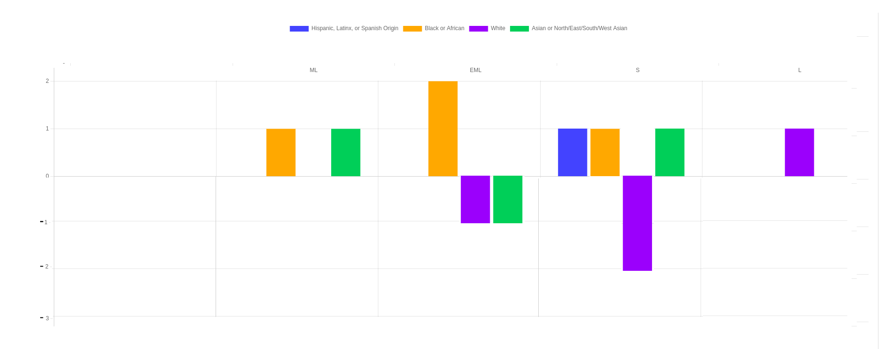

# Dei Explorer: Graphing Year-over-year Change in Skill Level By Gender/Racial Background

**Feature Name:** Graphing Year-over-year Change in Skill Level By Gender Identity/Racial Background

**Proposal Date:** 2023-11-16

**Author:** Conan Lai, Bre Porter, Bryan Washington

**Keywords:** skill level, delta, graph, gender identity, racial background 

## Summary

We are looking to add two new graphs to the DEI explorer in Stacks to help us better visualize how our skill level breakdowns by race and gender are evolving over time. Hugh has already taken the first step in getting us here by allowing stacks users to select the specific month that they would like to view our DEI data for. 

Using the month selected by the user (or the latest snapshot if no selection has been made), we would like to add graphs that visualize the delta between the skill level breakdown for the currently selected month and the skill level breakdown for the currently selected month in the previous year. 

## Underlying Logic 

As things are setup right now, we already calculate the skill level breakdowns by race and gender for the currently selected snapshot month. To support these new graphs, we would also need to calculate the skill level breakdowns by race and gender for the currently selected month in the previous year. Once this is calculated, we would simply subtract the previous year's count for eack skill level from the current one and then display it in a graph similar to the mockup provided below.

## Example Calculation

Let's break down how this would look for Skill Level by Racial Background for the current month (November, 2023). The data for the current year and previous year is displayed in a table below. Note that racial background names are simplified to not overly complicate the tables. 

November 2023    

| Racial Background | ML | EML | S | L |
| - | - |- | - | - |
| Hispanic| 0 | 0 | 2 | 0 |
| Black| 1 | 2 | 1 | 0 |
| White| 0 | 4 | 8 | 5 |
| Asian| 1 | 2 | 3 | 0 |

November 2022    
                                     
| Racial Background | ML | EML | S | L |
| - | - |- | - | - |
| Hispanic| 0 | 0 | 3 | 0 |
| Black| 2 | 2 | 1 | 0 |
| White| 0 | 4 | 7 | 3 |
| Asian| 1 | 1 | 4 | 0 |

To calculate the deltas for display in the new graph we would simply take the value from each cell in the 2023 table and subtract the value from the cell in the 2022 table. The results are displayed below. This delta would then be used to create a graph as shown in the mockup in the next section. 

Year-Over-Year Change November 2023                   
| Racial Background | ML | EML | S | L |
| - | - |- | - | - |
| Hispanic| 0 | 0 | -1 | 0 |
| Black| -1 | 0 | 0 | 0 |
| White| 0 | 0 | +1 | +2 |
| Asian| 0 | +1 | -1 | 0 |

## Mockup 

